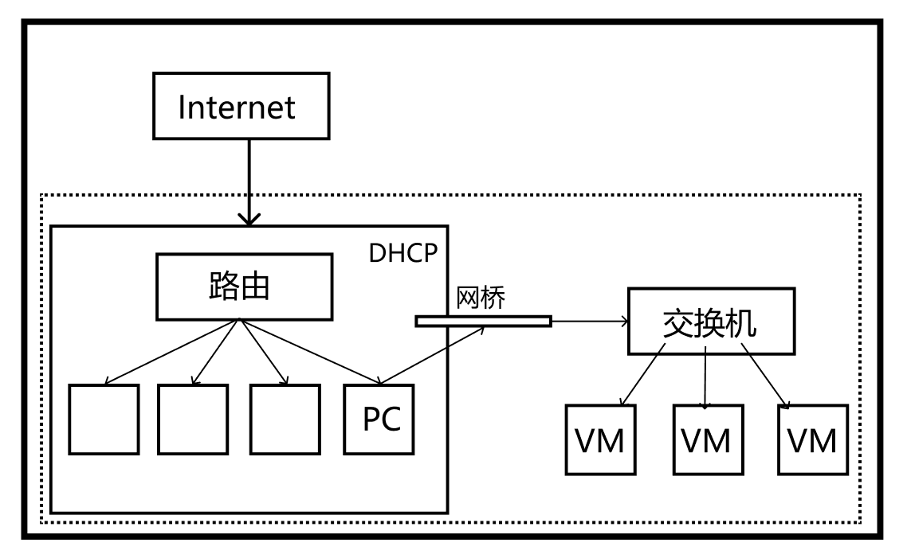
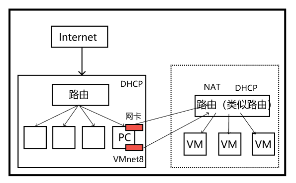
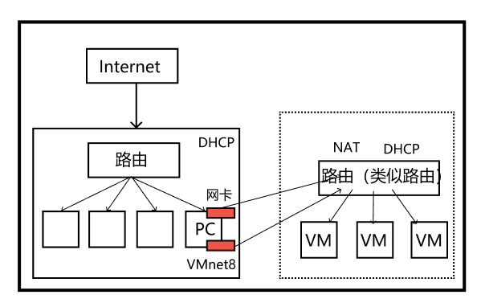
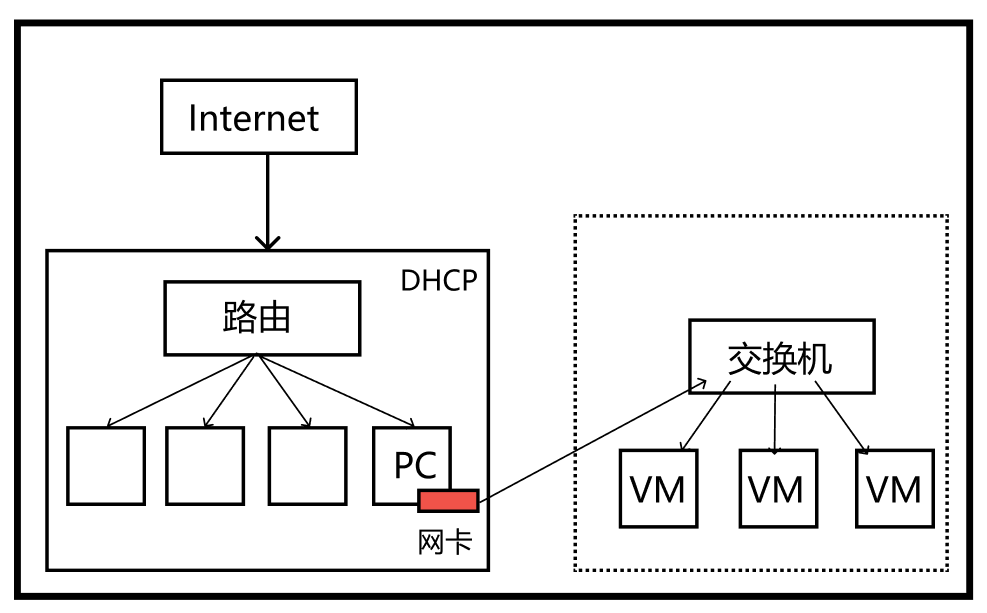

# Linux

## 网络配置和系统管理操作

### VMWare提供的三种网络连接模式

- 桥接模式

虚拟机直接连接外部物理网络的模式，主机起到了网桥的作用。这种模式下，虚拟机可以直接访问外部网络，并且对外部网络是可见的。

- NAT模式

虚拟机和主机构建一个专用网络，并通过虚拟网络地址转换（NAT）设备对IP进行转换。虚拟机通过共享主机IP可以访问外部网络，但外部网络无法访问虚拟机。

VMnet8的ip和虚拟机在一个网段

- 仅主机模式

虚拟机只与主机共享一个专用网络，与外部网络无法通信。

### 改主机名后立即生效

hostnamectl set hostname 新名字

### 查看所有服务（好像是这样）

systemctl list-unit-files

### tail -f 文件名的本质

linux所有文件都有一个唯一索引编号，tail -f的本质也就是监控这个索引编号，用vim的方式改东西以后貌似编号会变，查看编号方法：ls -i 文件名。用echo >> 好像不会改编号。

### 软链接和硬链接

区别，ln 后面加不加-s，加了表示软链接。软链接和硬链接就相对于二级指针和一级指针的关系一样。

### 文件表示

除了

-代表文件
d 代表目录
l 链接文档(link file)；

 以外

c:字符设备文件

b：块设备文件

### 查看内存情况

除基本的之外还有：free -h

### 将变量提升为全局变量

格式：export 变量名

但是在子shell里面改全局变量的值，不会改变父shell里的值

通过./shell.sh的时候，无法在里面输出局部变量，若要输出，要么将其提升为全局变量，要么用source shell.sh的方式执行