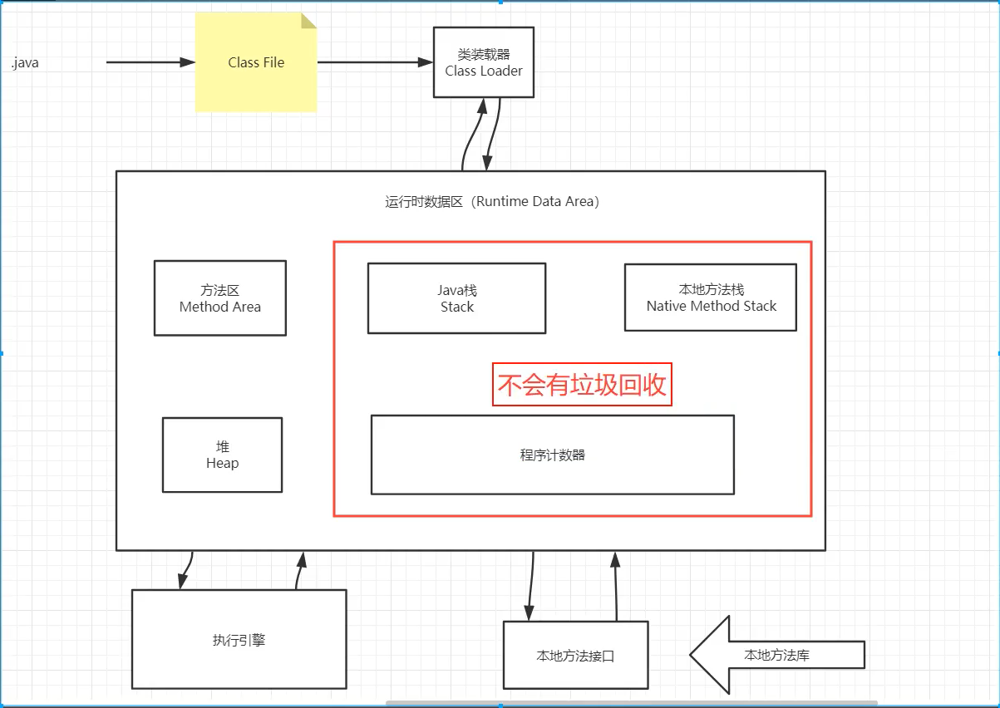
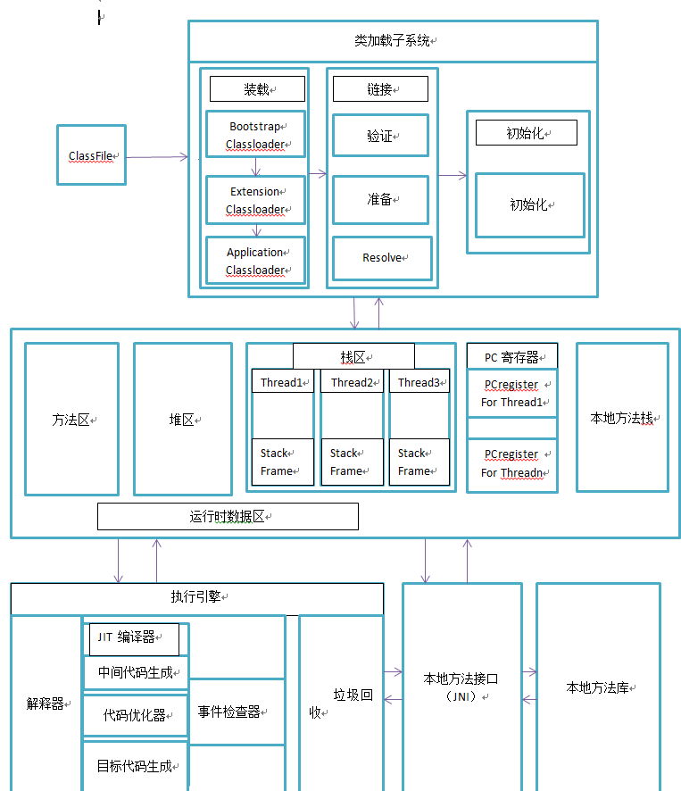
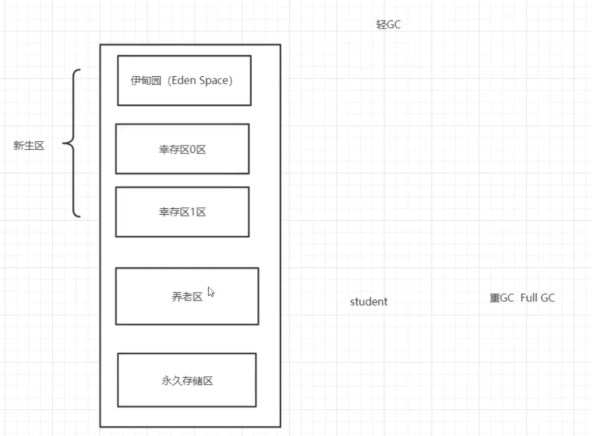

# JVM探究

- 请你谈谈对JVM的理解？java8虚拟机和之前的变化更新？
- 什么是OOM，什么是栈溢出StackOverFlowError?怎么分析？
- JVM的常用调优参数有哪些?
- 内存快照如何抓取，怎么分析Dump文件？
- 谈谈JVM中，你对类加载器的认识

## 1.jvm的位置

## 2.jvm体系结构

## 3.类加载器

作用：加载Class文件

1）虚拟机自带的加载器

2）启动类（根）加载器:null,java程序获取不到，原因：底层用C、C++写的

3）扩展类加载器:ExtClassLoader

4）应用程序（系统类）加载器：AppClassLoader

## 4.双亲委派机制

1）类加载器收到类加载的请求

2）将这个请求向上委托给父亲加载器去完成，一直向上委托，直到启动类加载器

3）启动加载器检查是否能够加载当前这个类，能加载就结束，使用当前的加载器，否则，排除异常，通知子加载器进行加载

4）重复第三步

接下来举个例子：

大家所熟知的Object类，直接告诉大家，Object默认情况下是自动类加载器进行加载的，假设我也自定义一个Object，并且制定加载器为自定义加载器。现在你会发现自定义的Object可以正常编译，但是永远无法被加载运行。

这是因为申请自定义Object加载时，综述启动类加载器，而不是自定义加载器，也不会是其他的加载器。

## 5.沙箱安全机制

### 什么是沙箱？

 Java安全模型的核心就是Java沙箱（sandbox），什么是沙箱？沙箱是一个限制程序运行的环境。沙箱机制就是将 Java 代码限定在虚拟机(JVM)特定的运行范围中，并且严格限制代码对本地系统资源访问，通过这样的措施来保证对代码的有效隔离，防止对本地系统造成破坏。沙箱**主要限制系统资源访问**，那系统资源包括什么？——CPU、内存、文件系统、网络。不同级别的沙箱对这些资源访问的限制也可以不一样。

​	所有的Java程序运行都可以指定沙箱，可以定制安全策略。

java中的安全模型：
 在Java中将执行程序分成本地代码和远程代码两种，本地代码默认视为可信任的，而远程代码则被看作是不受信的。对于授信的本地代码，可以访问一切本地资源。而对于非授信的远程代码在早期的Java实现中，安全依赖于沙箱 (Sandbox) 机制。如下图所示
 

JDK1.0安全模型

但如此严格的安全机制也给程序的功能扩展带来障碍，比如当用户希望远程代码访问本地系统的文件时候，就无法实现。因此在后续的 Java1.1 版本中，针对安全机制做了改进，增加了安全策略，允许用户指定代码对本地资源的访问权限。如下图所示

JDK1.1安全模型

在 Java1.2 版本中，再次改进了安全机制，增加了**代码签名**。不论本地代码或是远程代码，都会按照用户的安全策略设定，由类加载器加载到虚拟机中权限不同的运行空间，来实现差异化的代码执行权限控制。如下图所示

JDK1.2安全模型

当前最新的安全机制实现，则引入了域 (Domain) 的概念。虚拟机会把所有代码加载到不同的系统域和应用域，系统域部分专门负责与关键资源进行交互，而各个应用域部分则通过系统域的部分代理来对各种需要的资源进行访问。虚拟机中不同的受保护域 (Protected Domain)，对应不一样的权限 (Permission)。存在于不同域中的类文件就具有了当前域的全部权限，如下图所示

最新的安全模型

以上提到的都是基本的 Java 安全模型概念，在应用开发中还有一些关于安全的复杂用法，其中最常用到的 API 就是 doPrivileged。doPrivileged 方法能够使一段受信任代码获得更大的权限，甚至比调用它的应用程序还要多，可做到临时访问更多的资源。有时候这是非常必要的，可以应付一些特殊的应用场景。例如，应用程序可能无法直接访问某些系统资源，但这样的应用程序必须得到这些资源才能够完成功能。

### 组成沙箱的基本组件：

- `字节码校验器`（bytecode verifier）：确保Java类文件遵循Java语言规范。这样可以帮助Java程序实现内存保护。但并不是所有的类文件都会经过字节码校验，比如核心类。
- 类装载器（class loader）：其中类装载器在3个方面对Java沙箱起作用
  - 它防止恶意代码去干涉善意的代码；//双亲委派机制
  - 它守护了被信任的类库边界；
  - 它将代码归入保护域，确定了代码可以进行哪些操作。

  虚拟机为不同的类加载器载入的类提供不同的命名空间，命名空间由一系列唯一的名称组成，每一个被装载的类将有一个名字，这个命名空间是由Java虚拟机为每一个类装载器维护的，它们互相之间甚至不可见。

  类装载器采用的机制是双亲委派模式。

1. 从最内层JVM自带类加载器开始加载，外层恶意同名类得不到加载从而无法使用；
2. 由于严格通过包来区分了访问域，外层恶意的类通过内置代码也无法获得权限访问到内层类，破坏代码就自然无法生效。

- `存取控制器`（access controller）：存取控制器可以控制核心API对操作系统的存取权限，而这个控制的策略设定，可以由用户指定。
- `安全管理器`（security manager）：是核心API和操作系统之间的主要接口。实现权限控制，比存取控制器优先级高。
- 安全软件包（security package）：java.security下的类和扩展包下的类，允许用户为自己的应用增加新的安全特性，包括：
  - 安全提供者
  - 消息摘要
  - 数字签名 keytools,eg:https证书
  - 加密
  - 鉴别

## 6.Native

凡是带了native关键字的，说明Java的作用方法达不到了，回去调用底层C语言的库

会进入本地方法栈

调用本地方法本地接口 JNI

JNI作用：扩展java的使用，融合不同的编程语言为java所用

它在内存区域中专门开辟了一块标记区域：Native Method Stack,登记native方法

在最终执行时，加载本地方法库中的方法通过JNI

## 7.PC寄存器

程序技术器：Program Counter Register

每个线程都有一个程序计数器，是线程私有的，就是一个指针，只想方法区中的方法字节码（用来存储指向像一条指令的地址，也即将要执行的指令代码），在执行引擎读取下一条指令，是一个非常小的内存空间，几乎可以忽略不计

## 8.方法区

Method Area方法区

​	方法区是被所有线程共享，所有字段和方法字节码，以及一些特殊方法，如构造函数、接口代码也在此定义，简单说，所有定义的方法的信息都保存在该区域，此区域属于共享区间

​	静态变量、常量、类信息（构造方法、接口定义）、运行时的常量池存在方法区中，但是实例变量存在堆内存中，和方法区无关

static\final\Class\常量池

## 9.栈

数据结构

栈：栈内存，主管程序的运行，生命周期和线程同步；

线程结束，栈内存也就释放，对于栈来说，不存在垃圾回收问题

一旦线程结束，栈就Over

栈：8大基本类型+对象引用+实例的方法

栈原理：栈帧

## 10.三种JVM

Sun公司：HotSpot	(we learn)

BEA:JRockit

IBM:J9VM

## 11.堆

Heap,一个JVM只有一个堆内存，堆内存的大小是可以调节的

类加载器读取了类文件后，一般会把什么东西放到堆中？类：方法，常量，变量，保存我们所有引用类型的真实对象

堆内存还要细分为三个区域：

- 新生区

- 养老区

- 永久区

  

  GC垃圾回收，主要是在伊甸园区和养老区

  假设内存满了，OOM，堆内存不够。java.lang.OutOfMemoryError: Java heap space

  在JDK8以后，永久存储区改了给名字（元空间）

## 12.新生区，老年区

### 新生区

- 类：诞生和成长的地方，甚至死亡：
- 伊甸园，所有的对象都是在伊甸园区new出来的
- 幸存者区（0，1）

## 13.永久区

这个区域常驻内存，用来存放JDK自身携带的Class对象，Interface元数据，存储的是java运行时的一些环境或类信息，这个区域不存在垃圾回收，关闭VM虚拟机就会释放这个区域的内存

一个启动类，加载了大量的第三方jar包。Tomcat部署了太多的应用，大量动态生成的反射类，不断的被加载。直到内存满，就会出现OOM

- jdk1.6之前：永久代，常量池在方法区

- jdk1.7：永久代，但是慢慢退化了，去永久代，常量池在堆中

- jdk1.8之后，无永久代，常量池在元空间

  元空间：逻辑上存在，物理上不存在

## 14.堆内存调优

在一个项目中，突然出现了OOM故障，那么该如何排除，研究为什么出错

- 能够看到代码第几行出错：内存快照分析工具，MAT,Jprofiler

- Debug,一行行分析代码

  

  MAT,Jprofiler作用

  - 分析Dump内存文件，快速定位内存泄漏
  - 获得堆中的数据
  - 获得大的对象
  - ....

  

  常用配置：

  

  

  

  

## 15.GC（常用算法）

JVM在进行GC时，并不是对这三个区域统一回收，大部分时候，回收都是新生代

- 新生代
- 幸存区（from、to）
- 老年区

GC两种类：轻GC（普通的GC），重GC（全局GC）

GC题目：

- JVM的内存模型和分区，详细到每个区放什么？
- 堆里面的分区有哪些？Eden，from，to，老年区，说说他们的特点
  - GC的算法有哪些？标记清除法，标记整理法，复制算法，引用计数法，怎么用？			(弹幕发的一个据说也很方法分代收集法)
- 轻GC和重GC分别在什么时候发生？

### 引用计数法：

### 复制算法：

粗略的画图理解（想成一个动图?想不起来就看看视频，这图的确有点丑=.=）

- 好处：没有内存的碎片
- 坏处：浪费了内存空间：多了一半空间永远是空的（to区），假设对象100%存活（极端情况）成本会很高。

复制算法最佳使用场景：对象存货度较低的时候：新生区

### 标记清除压缩算法：

#### 标记清除

来自弹幕的科普：可达性分析（引用链法，判断标记用可达性分析）：查询对象从GCRoot-虚拟机栈-方法区静态应用-方法常量池-本地栈JNI，若无引用则GC

- 优点：不需要额外空间
- 缺点：两次扫描，严重浪费时间，会产生内存碎片

弹幕总结：判断对象的死活用根搜索算法或者标记-清除算法，但一般不使用后者

#### 标记压缩

再优化：防止内存碎片产生

先标记清除几次，再压缩

## 16.总结

内存效率：复制算法>标记清除算法>标记压缩算法（时间复杂度）

内存整齐度：复制算法>标记压缩算法>标记清除算法

内存利用率：标记压缩算法=标记清除算法>复制算法

GC：分代收集算法

年轻代

- 存活率低
- 复制算法

老年代

- 区域大：存活率高
- 标记清除（内存碎片不是太多时就先不急着压缩）+标记压缩混合实现

## 17.JMM（Java Memory Model）

1.什么是JMM？

​	百度百科

2.它干嘛的？

​	作用：缓存一致性协议，用于定义数据读写的规则（遵守，找到这个规则）

​	JMM定义了线程工作内存和主内存之间的抽象关系：线程之间的共享变量存储在主内存（Main Memory）中，每个线程都有一个私有的本地内存（Local Memory)

解决共享对象可见性这个问题:vililate

3.它该如何学习？

JMM：抽象的概念、理论

vililate

