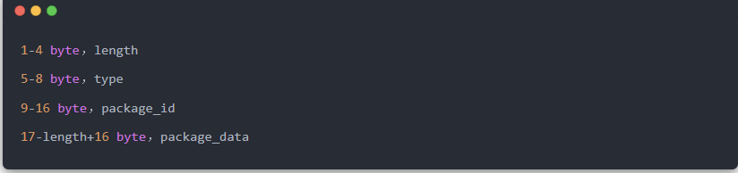
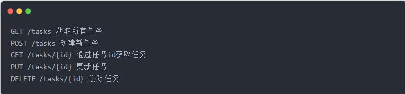
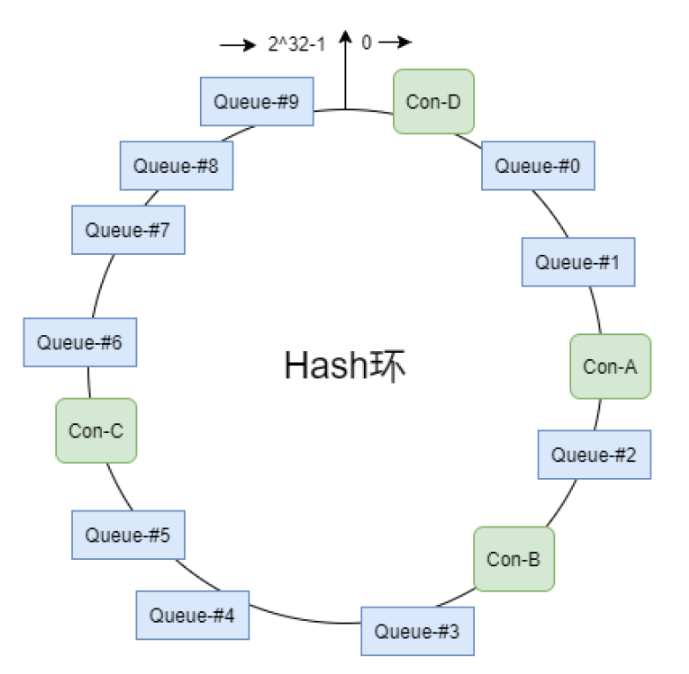
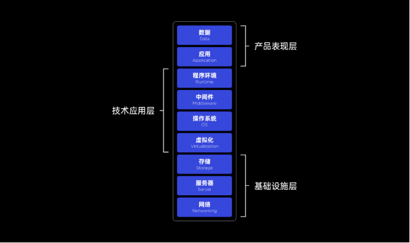
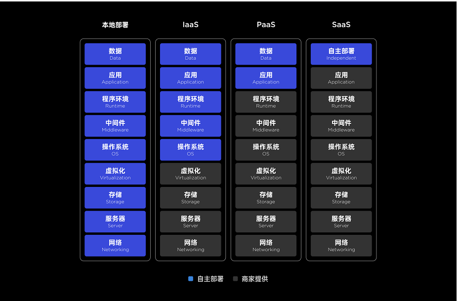

## RPC和HTTP比较（面试模拟版）

旁白：通过微信聊天方式模拟现场面试

**面试官**：**看你简历上写了项目用到rpc框架，说说你对rpc的理解**

大彬：RPC，英文全名remote procedure call，即**远程过程调用**

大彬：就是说一个应用部署在A服务器上，想要调用B服务器上应用提供的方法，由于**不在一个内存空间，不能直接调用**，需要通过网络来表达调用的语义和传达调用的数据

大彬：可以这么说，RPC就是要像调用本地的函数一样去调远程函数

**面试官**：**嗯，那为啥不能用HTTP请求，要用RPC调用呢？**

旁白：面试官你的八股文背的不对啊...

大彬：首先，RPC是一个完整的远程调用方案，它通常包括**通信协议和序列化协议**

大彬：其中，**通信协议**包含http协议（如gRPC使用http2）、自定义报文的tcp协议（如dubbo）

大彬：**序列化协议**包含基于文本编码的xml、json，基于二进制编码的protobuf、hessian等

大彬：而HTTP只是一个通信协议，不是一个完整的远程调用方案

大彬：也就是说，HTTP和RPC不是对等的概念，用来比较不太合适

大彬：这就像是牛（HTTP）不能和马车（RPC）比较。要想比较，就应该将牛改造为牛车，然后和马车比较

**面试官**：**行，那这么问吧，为什么有些后端子系统之间是使用自定义tcp协议的rpc来做进程通信？而不是用HTTP协议呢？**

大彬：首先，http协议是**支持连接池复用**的，也就是建立一定数量的连接不断开，并不会频繁的创建和销毁连接

大彬：然后，http也可以使用protobuf这种二进制编码协议对内容进行编码

大彬：也就是说连接建立与断开的开销和序列化协议并不是主要影响因素

大彬：二者最大的区别还是在**传输协议**上

大彬：http的传输协议中header部分有很多**冗余**的部分，像Content-Type、Last-Modified、Expires等

大彬：即使http body是使用二进制编码协议，header头的键值对却用了文本编码，非常占用字节数

大彬：而自定义的tcp协议，可以精简传输内容，传输效率更高。比如下面的自定义tcp协议的报文：

大彬：报头占用的字节数也就只有16个byte，大大地减少了传输内容。高并发情况下，少几个字节，乘以巨大的请求数量，能带来庞大的收益

大彬：因此，对于性能要求比较高的系统来说，通常使用自定义tcp协议的rpc来做后端进程通信

大彬：其实使用http协议比较多的还是前后端的通信，原因在于主流网页游览器都支持http协议，而且http在缓存、幂等重试乃至cookie这种浏览器安全相关的方面做了很多功夫

**面试官**：不错，理解的挺到位，今天面试就到这吧

## restful（面试模拟版）

**面试官**：**来说说你对restful的理解？**

大彬：REST，英文全称，Resource Representational State Transfer，对资源的访问状态的变化通过url的变化表述出来

大彬：Resource：**资源**。资源是REST架构或者说整个网络处理的核心

大彬：Representational：**某种表现形式**，比如用JSON，XML，JPEG等

大彬：State Transfer：**状态变化**。通过HTTP method实现

大彬：REST描述的是在网络中client和server的一种交互形式

大彬：用大白话来说，就是**通过URL就知道要什么资源，通过HTTP method就知道要干什么，通过HTTP status code就知道结果如何**

大彬：举个例子

大彬：GET代表获取一个资源，POST代表添加一个资源，PUT代表修改一个资源，DELETE代表删除一个资源。

大彬：server提供的RESTful API中，URL中只使用名词来指定资源，原则上不使用动词。

大彬：用`HTTP Status Code`传递server的状态信息。比如最常用的 200 表示成功，500 表示Server内部错误等。

旁白：总结一下，就是用URL定位资源，用HTTP描述操作

**面试官**：**嗯，那你觉得使用Restful风格有什么优势呢？**

大彬：第一，**风格统一**，不会出现`delUser/deleteUser/removeUser`各种命名的代码了

大彬：第二，**面向资源**，一目了然，具有自解释性

大彬：第三，**充分利用 HTTP 协议本身语义**

旁白：好吧，其他的编不下去了...

**面试官**：不错，今天面试就到这吧

## mmap零拷贝

1. 数据的四次拷贝与四次上下文切换

2. DMA 参与下的数据四次拷贝

3. 零拷贝技术

   3.1 什么是零拷贝技术

   3.2 sendfile

   3.3 mmap

   3.4 Direct I/O

4. 典型案例

   4.1 Kafka

   4.2 MySQL

5. 总结

------

> **注意事项** ：除了 Direct I/O，与磁盘相关的文件读写操作都有使用到 page cache 技术。

## 一致性哈希

该算法会将consumer的hash值作为Node节点存放到hash环上，然后将queue的hash值也放到hash环上，通过顺时针方向，距离queue最近的那个consumer就是该queue要分配的consumer。

> 该算法存在的问题：分配不均。好处：可以很好的减少rebalance带来的影响。

## 最优线程数计算模型

**C *（T1 + T2）/ T1**。

- C：CPU内核数
- T1：CPU内部逻辑计算耗时
- T2：外部IO操作耗时

> 最优线程数 = C *（T1 + T2）/ T1 = C * T1/T1 + C * T2/T1 = C + C * T2/T1
>
> 注意，该计算出的数值是理想状态下的理论数据，在生产环境中，不建议直接使用。而是根据当前环境，先设置一个比该值小的数值然后观察其压测效果，然后再根据效果逐步调大线程数，直至找到在该环境中性能最佳时的值。

## 看linux视频的时候学到的零散知识

### VMWare提供的三种网络连接模式

- 桥接模式

虚拟机直接连接外部物理网络的模式，主机起到了网桥的作用。这种模式下，虚拟机可以直接访问外部网络，并且对外部网络是可见的。

- NAT模式
- 仅主机模式

## CAP

在计算机科学中, CAP定理（CAP theorem）, 又被称作 布鲁尔定理（Brewer's theorem）, 它指出对于一个分布式计算系统来说，不可能同时满足以下三点:

- **一致性(Consistency)** (所有节点在同一时间具有相同的数据)
- **可用性(Availability)** (保证每个请求不管成功或者失败都有响应)
- **分隔容忍(Partition tolerance)** (系统中任意信息的丢失或失败不会影响系统的继续运作)

CAP理论的核心是：一个分布式系统不可能同时很好的满足一致性，可用性和分区容错性这三个需求，最多只能同时较好的满足两个。

因此，根据 CAP 原理将 NoSQL 数据库分成了满足 CA 原则、满足 CP 原则和满足 AP 原则三 大类：

- CA - 单点集群，满足一致性，可用性的系统，通常在可扩展性上不太强大。
- CP - 满足一致性，分区容忍性的系统，通常性能不是特别高。
- AP - 满足可用性，分区容忍性的系统，通常可能对一致性要求低一些。

## Saas

此处知识链接：https://mp.weixin.qq.com/s/ns7jefgRKo6kQb5vWv3FTQ

讲解什么是 Saas，或者刚刚图例出现的 Paas、laas 是什么，首先要认识一个问题，一个需要联网的软件，是如何落地的，需要哪些前提条件。

通常，我们可以把一个普通的联网产品要正式上线并使用，需要满足 9 个层级的条件，我们简称 “9层塔”，分别是：

#### **基础设施层**

基础设施层是一切网络服务的根基，由现实世界的硬件组成，是所有技术、代码、数据的运行基础。

#### **技术应用层**

技术应用层，就是具备了网络、服务器、硬盘以后，让这些基础设施充分发挥作用和能效的相关技术。

**中间件**

中间件也是个比较复杂的技术概念，它是个独立系统软件服务程序，是软件的直接面向对象（而不是服务器），是一种支撑软件。

举个不太严谨的例子，我们常规的逻辑是一个程序对应一台服务器（或虚拟机），但真实情况往往是一个程序会关联好几个服务器和不同的系统，来完成不同的网络服务。正常情况下，你需要对每个服务器和系统进行适配。

而中间件的作用就是帮助你省掉这个麻烦的步骤，让你只需要对接唯一的翻译和话事人，他会帮你向不同的任务对象传达你的要求。

#### **产品表现层**

**应用（Application）**

在这个系统下，应用程序指的不是你在自己电脑手机上安装的程序。而是安装在服务器上运行的程序，不管是后端程序还是前端程序。

它们需要使用某些特定的程序语言来编写，并运行在上面所说的对应环境中。我们所说的后端开发，通常就是开发服务器所运行的程序的程序员。

**数据（Data）**

这个词放在这里可能有比较大的歧义，数据实际上就是使用这个程序所产生出来的数据，而不是单指数据库（数据库也是环境的一部分）。

比如你打开一个网站注册了账号，上传了头像，那么这些信息就是使用程序所额外产生的数据，它是项目正常运作的必然产品。

#### **SaaS 到底是什么**

理解上面的9个层级的内容是什么，我们就可以看下面这张图表了。

SaaS 全程 Software-as-a-Service，翻译叫 “软件即服务”，讲人话就是 “卖联网软件” 的。

前面提的 9 个层级，除了最后一层数据是我们普通人可以负责的，其它每个层级都需要对应的开发和工程师来负责对吧，那么我们普通人还是企业就不能使用网络软件服务了嘛？

这肯定是不符合事物发展规律的。

SaaS 的存在，就是让用户不用管什么服务器、代码、中间件这些有的没的高深玩意，直接让你在浏览器或本地客户端上直接使用这款联网软件，并创建对应的数据信息。

换句话讲，只要这个软件是联网的，且软件本身的功能就是服务的核心（**划重点：社区电商类软件的服务显然不是软件功能本身**），它就是 SaaS。SaaS 既可以免费，也可以是通过**批量**出售软件功能的使用权来赚取收益。

**免费情景：**

> 微软：如果你使用了基于 Web 的电子邮件服务（例如 Outlook、Hotmail 或 Yahoo!Mail），那么你已经使用一种形式的 SaaS。
>
> https://azure.microsoft.com/zh-cn/overview/what-is-saas/

在 B 端的语境下，SaaS 通常就是指制作一个面向商业用户的联网软件，然后批量出售这个软件的使用权。它并没有特指这个软件必须是 CRM、ERP、HRM 还是商用 HMI……

所以明白了嘛，**SaaS 只是一个商业形式或技术形式的统称，它根本没有具体的设计规范或者学习方法，完全根据业务的实际需求和场景决定**

链接：https://mp.weixin.qq.com/s/jTtSvW4fZuh_peHEGY4hSQ

#### Saas外的服务类型

在 9 层塔中，SaaS 是完全制作好软件让用户直接上手使用的软件，而 PaaS 和 IaaS 就不一样。

